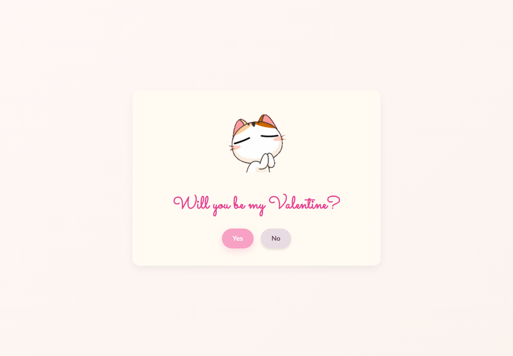
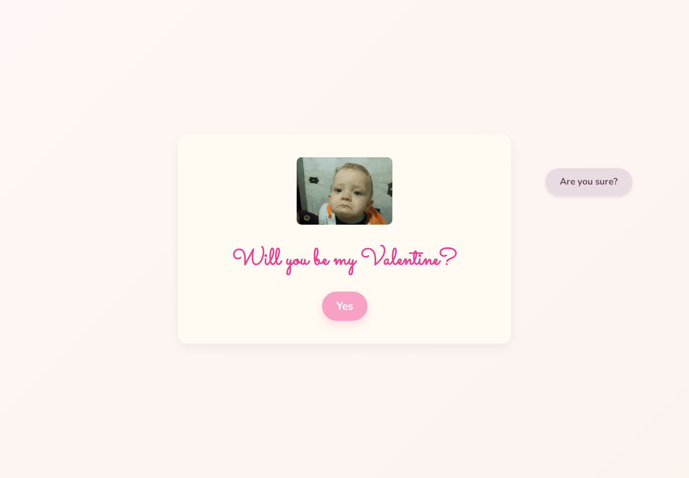
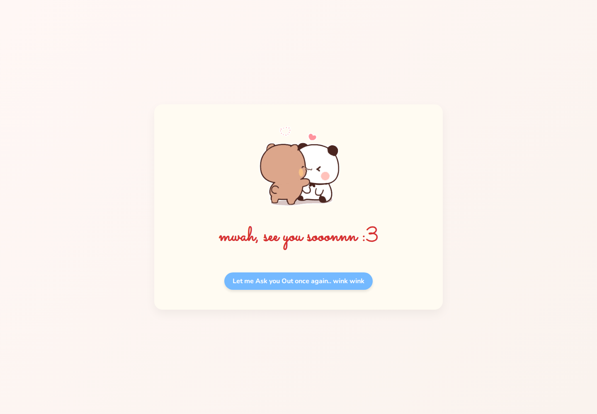

<div align="center">

# Will You Be My Valentine?

### A tiny interactive web experience built with HTML, CSS and vanilla JavaScript.

A playful single-page project built around a simple question, reactive button behaviour and a small success screen.

[**Source Code**](https://github.com/T0T0R0-byte/will-you-be-my-valentine-site)


</div>

---

## What it is

This project is a small interactive Valentine-themed website with two main states:

1. A question screen with Yes and No buttons.
2. A success screen shown after choosing Yes.

The interaction is driven entirely by client-side JavaScript.

## Product Showcase

### The Question



### After Choosing No



### After Choosing Yes



## Interaction Details

The page starts with a simple invitation.

Choosing **No** changes the button message, cycles through reaction images, increases the size of the Yes button and moves the No button to a random position on the screen.

Choosing **Yes** switches the page to the success state.

The final button reloads the page so the interaction starts over.

## Built With

HTML5 · CSS3 · Vanilla JavaScript · Google Fonts · Tenor GIFs

## Project Structure

```text
.
├── index.html
├── style.css
├── script.js
└── docs/
    └── screenshots/
```

## Run Locally

No package installation is required.

```bash
git clone https://github.com/T0T0R0-byte/will-you-be-my-valentine-site.git
cd will-you-be-my-valentine-site
python -m http.server 8000
```

Open http://localhost:8000 in your browser.

## Notes

The project is intentionally small and framework-free. All interaction logic lives in `script.js`, while `style.css` handles the responsive presentation.

<div align="center">

Made as a small front-end experiment.

</div>
